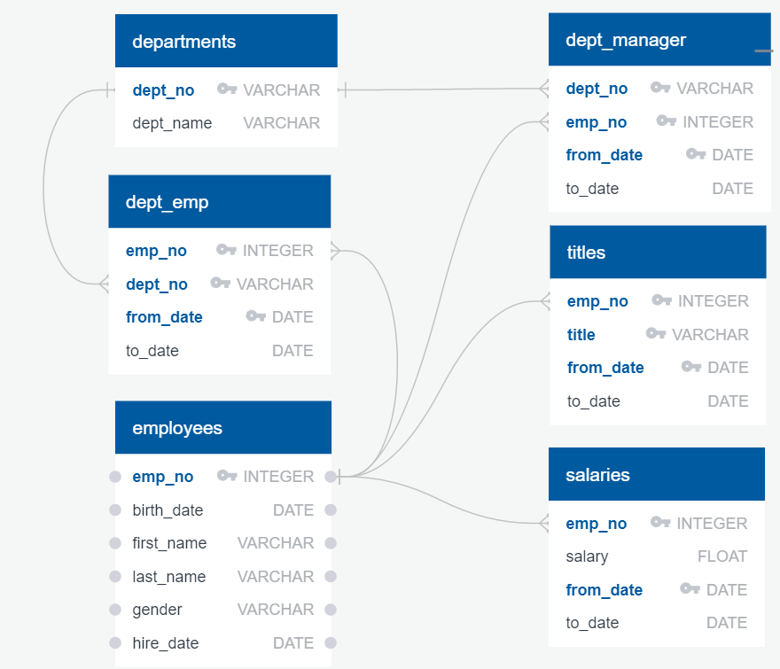
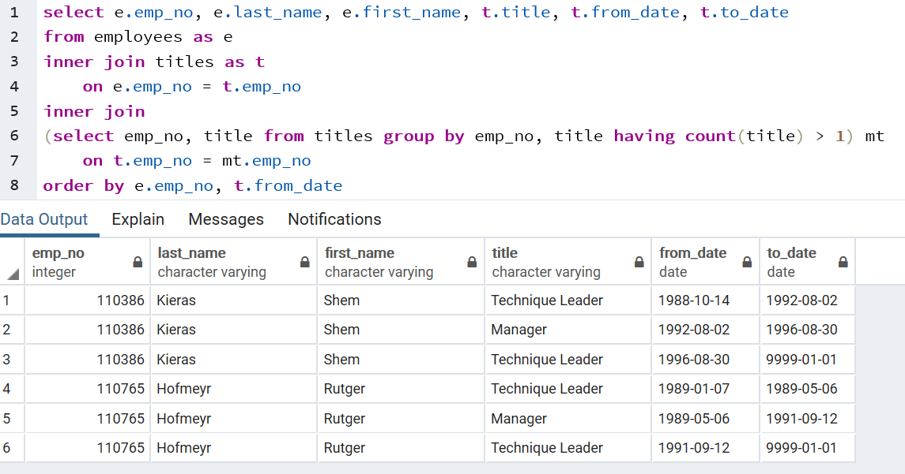
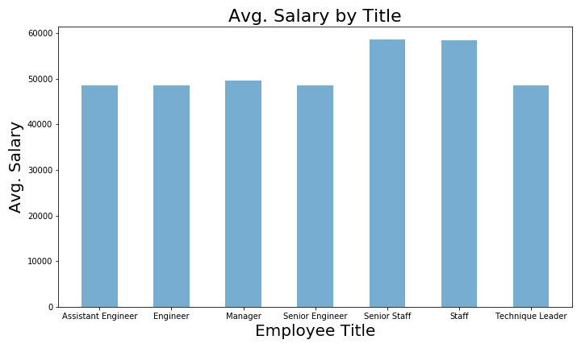

# Home Work Assignment - SQL - Techinical Report

# Assignment Scope

* Data Modeling: for Employee SQL Database, creating a Entity Relationship Diagram (ERD).
* Data Engineering: based on the ERD, create the SQL table, and import the CSVs provided.
* Data Analysis: Analyze the data in the Employee table, to answer the questions asked. 

# Data Analysis Questions:
1. List the following details of each employee: employee number, last name, first name, gender, and salary.
2. List employees who were hired in 1986.
3. List the manager of each department with the following information: department number, department name, the manager's employee number, last name, first name, and start and end employment dates.
4. List the department of each employee with the following information: employee number, last name, first name, and department name.
5. List all employees whose first name is "Hercules" and last names begin with "B."
6. List all employees in the Sales department, including their employee number, last name, first name, and department name.
7. List all employees in the Sales and Development departments, including their employee number, last name, first name, and department name.
8. In descending order, list the frequency count of employee last names, i.e., how many employees share each last name.

# Data Modeling:
1. Employees table: 
    * emp_no has to be unique and will be the primary key, no two employee will share a emp_id.
    * Also first name, last name, date of birth, gender and hire date are required field. 
2. Departments table:
    * dept_no should be unique and will be primary key.
    * dept_name is required, department name cannot be blank.
3. Employees and Department junction table: 
    * Since each employee is assigned to a department, the dept_emp table will give the relationship information.
    * since employee can be assigned to various department in an organization, and since the employee can enter, exit and re-enter an department, the combination of dept_no, emp_no and from_date should has to be unique. 
4. Department and manager junction table:
    * This table defines the manager assigned to each department, over the period of time. 
    * so this table will have dept_no, manager's emp_id and from date as unique. 
5. Salary:
    * This table will hold the salary of the employee.
    * since we need to store the from and to date for the salary, for each of the employee. we will have emp_no and from_data as unique or primary key cluster. 
6. Title:
    * This holds the title of the employee over the employment period. 
    * An employee can hold different title over the period of time, and can exit (releave temporary, quit and reemploy, take a different role temporarly).
    * with the above said, this table will have emp_no, title and from date as unique and will be the combination of primary key. 

## Table design for http://www.quickdatabasediagrams.com.
* [Table Design](Table_Design.txt)

## Entity Relationship Diagram (ERD)

# Data Engineering:

## Table Creation Script
* Table creation script, along with Primary key, Foreign Key definitions. 
* [Table Create Script](Table_Create_Script.sql)

## Data Import script, from CSV file
* Data import from CSV, using copy command
* [CSV Data Import](CSV_Import_Query.sql)

# Data Analysis:
## Data analysis, and answering the 8 questions, in the scope.
* [Data Analysis Query](Data_Analysis_Query.sql)

## Bonus Jupyter Notebook for Avg. Salary Vs Title.
* [Employee Jupyter Notebook](EmployeePy.ipynb)

## Employee, assigned to different title over the period of employment.
* Since employee can be assigned to different title during the employment, they can enter, exit and re-enter a title. hence title and dept_manager table should have from_date in the primary key allong with the employee id and title or dept_id respectively.

## Bonus Avg. Salary by Title

## Conclusion
* From Average Salary by Title, its surprising that most title have the same average salary. except the staff and senior staff.
* The Salary table is not up-to-date with the titles table
    * Employee 10004, is a "Senior Engineer" from 1995-12-01, but the salary detail is available only till "1987-12-01", (with a salary of 40054.0)
    * So this may not give an accurate detail for the Avg. Salary by Title Bar chart. 

### Thank you 

This work is part of the `SQL Homework assignment` by `UOM Data Analysis and Visualization Bootcamp`.

Submited by : Ganeshkumar Gurunathan
